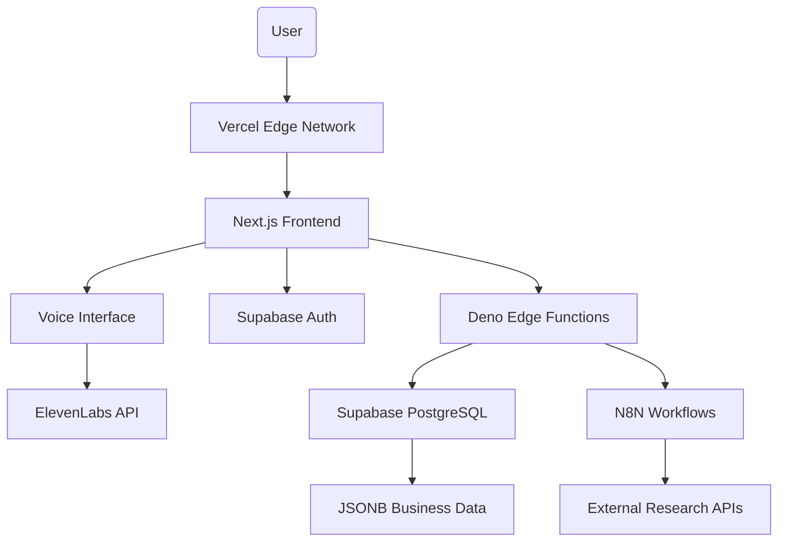

# SuperSwift Interview Agent - Consolidated Architecture Document

## Introduction

This document outlines the consolidated fullstack architecture for the SuperSwift Assessment Interview Agent, reflecting the actual implemented state and removing outdated elements from the original design. This serves as the definitive architectural reference, reconciling the initial vision with the practical implementation using the Next.js SaaS starter kit foundation.

### Project Foundation

The project is built upon the **Next.js SaaS Starter Kit**, which provides a solid foundation of modern web technologies. We've customized it specifically for voice-first business interviews while maintaining the robust architecture and best practices of the original starter kit.

### Change Log

| Date | Version | Description | Author |
|------|---------|-------------|--------|
| 2025-09-20 | 3.0 | Integrated 3-tier data architecture with agent collaboration system | Winston 🏗️ |
| 2025-09-17 | 2.0 | Consolidated architecture reflecting actual implementation | Winston 🏗️ |
| 2025-09-17 | 1.0 | Initial architecture draft | Winston 🏗️ |

## High Level Architecture

### Technical Summary

The SuperSwift Interview Agent uses a **monorepo architecture** built on **Next.js with Supabase** as specified in the PRD. The system integrates **ElevenLabs API** for voice-first interactions, **N8N workflows** for data orchestration, and **Supabase** with **Deno Edge Functions** for backend logic. This architecture enables sophisticated business discovery through natural voice interaction while maintaining the complex data structures required for strategic consulting analysis.

### Platform and Infrastructure Choice

**Platform:** Supabase + Vercel  
**Key Services:** Supabase Database, Deno Edge Functions, ElevenLabs API, N8N Workflows  
**Deployment Host and Regions:** Vercel Global Edge Network + Supabase Global  

### Repository Structure

**Structure:** Monorepo architecture (as specified in PRD)  
**Monorepo Tool:** TBD - Will need to implement monorepo structure  
**Package Organization:** Multiple packages for frontend, backend, shared types, and workflows  

### High Level Architecture Diagram



### Architectural Patterns

- **Monorepo Architecture:** Multiple packages for frontend, backend, workflows, and shared types - _Rationale:_ Required by PRD, enables code sharing and coordinated development
- **Voice-First Architecture:** ElevenLabs API integration for natural speech interaction - _Rationale:_ Core requirement for natural business discovery conversations
- **JSONB Data Modeling:** Complex nested business data structures in PostgreSQL - _Rationale:_ Strategic consulting requires sophisticated data capture for business context
- **Workflow Orchestration:** N8N for data flows and external integrations - _Rationale:_ Specified in PRD for backend hosting and data pipeline management
- **Edge Functions Pattern:** Deno Edge Functions for serverless backend logic - _Rationale:_ PRD specification for server-side code execution

## Tech Stack

### Technology Stack Table

| Category | Technology | Version | Purpose | Rationale |
|----------|------------|---------|---------|-----------|
| **Frontend Framework** | Next.js | Latest | Primary frontend framework | PRD requirement, part of nextjs-starter-kit foundation |
| **Backend Runtime** | Deno Edge Functions | Latest | Serverless backend logic | PRD specification for server-side code |
| **Database** | Supabase PostgreSQL | Latest | Primary database with JSONB | PRD requirement, supports complex business data structures |
| **Language** | TypeScript | 5.x | Type-safe development | Essential for monorepo and complex data models |
| **Voice AI** | ElevenLabs API | Latest | Text-to-speech and speech-to-text | PRD requirement for voice-first interface |
| **Authentication** | Supabase Auth | Latest | User authentication and sessions | Integrated with Supabase database |
| **Workflow Engine** | N8N | Latest | Data flows and integrations | PRD requirement for backend hosting and orchestration |
| **UI Components** | shadcn/ui | Latest | Component library | Professional B2B interface requirements |
| **Styling** | Tailwind CSS | Latest | Utility-first CSS framework | Clean, modern, professional design requirement |
| **Monorepo Tool** | TBD | Latest | Multi-package management | PRD requires monorepo structure |
| **Cloud Hosting** | Vercel | Latest | Frontend hosting | Excellent Next.js integration |
| **Testing** | Unit + Integration | Latest | Quality assurance | PRD testing requirements |

## Data Models - 3-Tier Architecture

### Overview: Assessment Research → Interview → Business Intelligence Pipeline

The SuperSwift Assessment system uses a **3-tier data architecture** that separates concerns across distinct data layers, each with specific purposes, retention policies, and access patterns.

```
Tier 1: Research Data (Input Layer)
    ↓ Data Flow  
Tier 2: Assessment Interview Data (Working Layer)
    ↓ Data Synthesis
Tier 3: Company Business Intelligence (MCP Target Layer)
```

### Tier 1: Research Data (Input Layer)

**Purpose:** Raw intelligence from n8n research workflows  
**Lifecycle:** Generated → Consumed → Archived (90 days)  
**Access Pattern:** Internal processing only

**Key Attributes:**
- id: string - Primary key
- company_url: string - Company website for research
- research_timestamp: timestamp - When research was conducted
- web_scraping_results: jsonb - Website and content analysis
- social_media_analysis: jsonb - Social media presence and engagement
- financial_data: jsonb - Financial information and metrics
- news_mentions: jsonb - Recent news and press coverage
- competitor_data: jsonb - Competitive analysis
- industry_analysis: jsonb - Industry trends and context
- llm_provider: string - Which LLM provider was used
- confidence_scores: jsonb - Quality scores for each data type
- source_urls: string[] - Source URLs for research data
- processing_status: string - Research completion status

### Tier 2: Assessment Interview Data (Working Layer)

**Purpose:** Interview state management and user interaction tracking  
**Lifecycle:** Created → Updated during interview → Processed → Archived (60 days)  
**Access Pattern:** Interview agents and specific user

**Key Attributes:**
- id: string - Primary key
- user_id: string - References users table
- company_url: string - Company being assessed
- research_data_id: string - References Tier 1 research
- current_step: string - Current interview step
- interview_status: string - Interview state (in_progress, completed)
- step_data: jsonb - Step-by-step working data with artifact organization:
  ```typescript
  {
    // 9 Assessment Steps with Artifact Structure
    "step_1_core_identity": {
      artifacts: {
        "artifact_1_company_mission_vision": {
          research_input: any;      // Original from Tier 1 research
          user_confirmations: any;  // What user confirmed as accurate
          user_corrections: any;    // What user corrected/changed  
          user_additions: any;      // New information user provided
          completion_status: 'pending' | 'in_progress' | 'completed';
        },
        "artifact_2_core_offering_definition": { /* same structure */ },
        "artifact_3_regulatory_pathway": { /* same structure */ },
        "artifact_4_revenue_streams_pricing": { /* same structure */ }
      },
      step_completion_status: 'pending' | 'in_progress' | 'completed';
      open_questions: string[];     // Questions still needing validation
      step_confidence_score: number; // 0-100 based on artifact completion
    },
    "step_2_customer_market": {
      artifacts: {
        "artifact_5_market_sizing": { /* artifact structure */ },
        "artifact_6_clinical_evidence": { /* artifact structure */ },
        "artifact_7_ideal_customer_profile": { /* artifact structure */ },
        "artifact_8_customer_pains_gains": { /* artifact structure */ }
      },
      // ... same step-level fields
    },
    // ... steps 3-9 with their respective artifacts
  }
  ```
- conversation_log: jsonb - Current step conversation history (step-scoped memory)
- voice_interaction_metadata: jsonb - ElevenLabs interaction data
- started_at: timestamp - Interview start time
- completed_at: timestamp - Interview completion time
- last_activity: timestamp - Last user interaction

### Tier 3: Company Business Intelligence (MCP Target Layer)

**Purpose:** Final, validated business intelligence for team collaboration  
**Lifecycle:** Created from assessment → Team collaboration → Persistent  
**Access Pattern:** MCP server routes, company team members

**Key Attributes:**
- id: string - Primary key
- company_url: string - Unique company identifier

**PART 1: STRATEGIC FOUNDATION (Steps 1-2)**
- artifact_1_company_mission_vision: jsonb - Company Mission & Vision
- artifact_2_core_offering_definition: jsonb - Core Offering Definition  
- artifact_3_regulatory_pathway: jsonb - Regulatory Pathway & Classification (MedTech)
- artifact_4_revenue_streams_pricing: jsonb - Revenue Streams & Pricing Model
- artifact_5_market_sizing: jsonb - Market Sizing (TAM, SAM, SOM)
- artifact_6_clinical_evidence: jsonb - Clinical Evidence & KOL Strategy (MedTech)
- artifact_7_ideal_customer_profile: jsonb - Ideal Customer Profile & Buyer Personas
- artifact_8_customer_pains_gains: jsonb - Customer Pains & Gains

**PART 2: STRATEGY & POSITIONING (Steps 3-6)**
- artifact_9_direct_indirect_competitors: jsonb - Direct & Indirect Competitors
- artifact_10_competitive_positioning: jsonb - Competitive Positioning & Differentiation
- artifact_11_channel_strategy: jsonb - Channel Strategy Overview
- artifact_12_sales_process_methodology: jsonb - Sales Process & Methodology
- artifact_13_gtm_team_structure: jsonb - GTM Team Structure & Roles
- artifact_14_strategic_partnership_framework: jsonb - Strategic Partnership Framework
- artifact_15_partner_enablement: jsonb - Partner Enablement & Incentive Models
- artifact_16_brand_positioning_statement: jsonb - Brand Positioning Statement
- artifact_17_core_messaging_pillars: jsonb - Core Messaging Pillars

**PART 3: EXECUTION & OPERATIONS (Steps 7-9)**
- artifact_18_quality_management_system: jsonb - Quality Management System Overview (MedTech)
- artifact_19_implementation_roadmap: jsonb - High-Level Implementation Roadmap & Timeline
- artifact_20_gtm_process_tech_stack: jsonb - GTM Process & Tech Stack
- artifact_21_core_gtm_kpis: jsonb - Core GTM KPIs
- artifact_22_strategic_gtm_goals: jsonb - Strategic GTM Goals
- artifact_23_gtm_risk_assessment: jsonb - Comprehensive GTM Risk Assessment

**Team Collaboration & Versioning:**
- created_by: string - User who created the assessment
- last_updated_by: string - User who last updated
- team_access_list: string[] - User IDs with access
- version_number: integer - Version tracking
- change_history: jsonb - Audit trail of changes
- created_at: timestamp - Creation time
- updated_at: timestamp - Last update time

**Entity Structure:**
```typescript
interface BusinessIntelEntity {
  data: any;                    // Core business data
  status: 'draft' | 'validated' | 'published';
  confidence_score: number;     // 0-100
  sources: {
    research_derived: boolean;
    user_validated: boolean; 
    user_corrected: boolean;
  };
  last_updated: timestamp;
  updated_by: string;
}
```

### Interview Session

**Purpose:** Track interview progress and conversation history

**Key Attributes:**
- id: string (UUID) - Unique session identifier
- userId: string - References interviewer
- companyProfileId: string - Links to company being interviewed
- conversationLog: string (JSON) - Complete conversation history
- currentStep: string - Current position in interview flow
- status: string - Session state (active, paused, completed)
- createdAt/updatedAt: timestamps - Session timeline

### User (Better Auth)

**Purpose:** User authentication and profile management

**Key Attributes:**
- id: string - Primary key
- name: string - User display name
- email: string - Authentication email
- emailVerified: boolean - Email verification status
- image: string - Profile image URL
- createdAt/updatedAt: timestamps - Account lifecycle

## Database Schema (Supabase PostgreSQL) - 3-Tier Architecture

```sql
-- Supabase Users Table (managed by Supabase Auth)
-- Users are automatically created by Supabase Auth

-- =================
-- TIER 1: RESEARCH DATA (INPUT LAYER)
-- =================
CREATE TABLE public.research_data (
    id UUID PRIMARY KEY DEFAULT uuid_generate_v4(),
    company_url TEXT NOT NULL,
    research_timestamp TIMESTAMPTZ DEFAULT now(),
    
    -- Research findings
    web_scraping_results JSONB,
    social_media_analysis JSONB,
    financial_data JSONB,
    news_mentions JSONB,
    competitor_data JSONB,
    industry_analysis JSONB,
    
    -- Processing metadata
    llm_provider TEXT,
    confidence_scores JSONB,
    source_urls TEXT[],
    processing_status TEXT DEFAULT 'pending',
    
    created_at TIMESTAMPTZ DEFAULT now()
);

-- Indexes for efficient research data access
CREATE INDEX idx_research_company_url ON research_data(company_url);
CREATE INDEX idx_research_timestamp ON research_data(research_timestamp);
CREATE INDEX idx_research_status ON research_data(processing_status);

-- =================
-- TIER 2: ASSESSMENT INTERVIEW DATA (WORKING LAYER)
-- =================
CREATE TABLE public.assessment_sessions (
    id UUID PRIMARY KEY DEFAULT uuid_generate_v4(),
    user_id UUID REFERENCES auth.users(id),
    company_url TEXT NOT NULL,
    research_data_id UUID REFERENCES public.research_data(id),
    
    -- Interview state
    current_step TEXT,
    interview_status TEXT DEFAULT 'in_progress',
    
    -- Step-by-step working data
    step_data JSONB DEFAULT '{}'::JSONB,
    -- Structure: {
    --   "company_overview": {
    --     "research_input": {...},
    --     "user_confirmations": {...},
    --     "user_corrections": {...},
    --     "user_additions": {...},
    --     "completion_markers": {...},
    --     "open_questions": [...],
    --     "confidence_score": 85,
    --     "completion_status": "completed"
    --   }
    -- }
    
    -- Conversation tracking (step-scoped memory)
    conversation_log JSONB DEFAULT '[]'::JSONB,
    voice_interaction_metadata JSONB,
    
    -- Session metadata
    started_at TIMESTAMPTZ DEFAULT now(),
    completed_at TIMESTAMPTZ,
    last_activity TIMESTAMPTZ DEFAULT now()
);

-- Indexes for interview session management
CREATE INDEX idx_assessment_user ON assessment_sessions(user_id);
CREATE INDEX idx_assessment_company ON assessment_sessions(company_url);
CREATE INDEX idx_assessment_status ON assessment_sessions(interview_status);
CREATE INDEX idx_assessment_activity ON assessment_sessions(last_activity);

-- =================
-- TIER 3: COMPANY BUSINESS INTELLIGENCE (MCP TARGET LAYER)
-- =================
CREATE TABLE public.company_business_intel (
    id UUID PRIMARY KEY DEFAULT uuid_generate_v4(),
    company_url TEXT UNIQUE NOT NULL,
    
    -- PART 1: STRATEGIC FOUNDATION (Steps 1-2) - 8 artifacts
    artifact_1_company_mission_vision JSONB,
    artifact_2_core_offering_definition JSONB,
    artifact_3_regulatory_pathway JSONB,
    artifact_4_revenue_streams_pricing JSONB,
    artifact_5_market_sizing JSONB,
    artifact_6_clinical_evidence JSONB,
    artifact_7_ideal_customer_profile JSONB,
    artifact_8_customer_pains_gains JSONB,
    
    -- PART 2: STRATEGY & POSITIONING (Steps 3-6) - 9 artifacts
    artifact_9_direct_indirect_competitors JSONB,
    artifact_10_competitive_positioning JSONB,
    artifact_11_channel_strategy JSONB,
    artifact_12_sales_process_methodology JSONB,
    artifact_13_gtm_team_structure JSONB,
    artifact_14_strategic_partnership_framework JSONB,
    artifact_15_partner_enablement JSONB,
    artifact_16_brand_positioning_statement JSONB,
    artifact_17_core_messaging_pillars JSONB,
    
    -- PART 3: EXECUTION & OPERATIONS (Steps 7-9) - 6 artifacts
    artifact_18_quality_management_system JSONB,
    artifact_19_implementation_roadmap JSONB,
    artifact_20_gtm_process_tech_stack JSONB,
    artifact_21_core_gtm_kpis JSONB,
    artifact_22_strategic_gtm_goals JSONB,
    artifact_23_gtm_risk_assessment JSONB,
    
    -- Multi-user collaboration
    created_by UUID REFERENCES auth.users(id),
    last_updated_by UUID REFERENCES auth.users(id),
    team_access_list UUID[], -- User IDs with access
    
    -- Versioning and audit
    version_number INTEGER DEFAULT 1,
    change_history JSONB DEFAULT '[]'::JSONB,
    
    created_at TIMESTAMPTZ DEFAULT now(),
    updated_at TIMESTAMPTZ DEFAULT now()
);

-- Indexes for MCP server efficiency
CREATE INDEX idx_business_intel_company ON company_business_intel(company_url);
CREATE INDEX idx_business_intel_team ON company_business_intel USING GIN(team_access_list);
CREATE INDEX idx_business_intel_updated ON company_business_intel(updated_at);

-- Individual artifact indexes for fast MCP route access
CREATE INDEX idx_bi_artifact_1 ON company_business_intel USING GIN(artifact_1_company_mission_vision);
CREATE INDEX idx_bi_artifact_7 ON company_business_intel USING GIN(artifact_7_ideal_customer_profile);
CREATE INDEX idx_bi_artifact_9 ON company_business_intel USING GIN(artifact_9_direct_indirect_competitors);
CREATE INDEX idx_bi_artifact_10 ON company_business_intel USING GIN(artifact_10_competitive_positioning);
CREATE INDEX idx_bi_artifact_16 ON company_business_intel USING GIN(artifact_16_brand_positioning_statement);
CREATE INDEX idx_bi_artifact_21 ON company_business_intel USING GIN(artifact_21_core_gtm_kpis);
CREATE INDEX idx_bi_artifact_23 ON company_business_intel USING GIN(artifact_23_gtm_risk_assessment);

-- =================
-- ROW LEVEL SECURITY (RLS) POLICIES
-- =================
ALTER TABLE public.research_data ENABLE ROW LEVEL SECURITY;
ALTER TABLE public.assessment_sessions ENABLE ROW LEVEL SECURITY;
ALTER TABLE public.company_business_intel ENABLE ROW LEVEL SECURITY;

-- Research data: Internal processing only (no direct user access)
CREATE POLICY "Service role access research data" ON public.research_data
    FOR ALL USING (auth.role() = 'service_role');

-- Assessment sessions: Users can only access their own
CREATE POLICY "Users can view own assessment sessions" ON public.assessment_sessions
    FOR SELECT USING (auth.uid() = user_id);

CREATE POLICY "Users can insert own assessment sessions" ON public.assessment_sessions
    FOR INSERT WITH CHECK (auth.uid() = user_id);

CREATE POLICY "Users can update own assessment sessions" ON public.assessment_sessions
    FOR UPDATE USING (auth.uid() = user_id);

-- Business intelligence: Team-based access control
CREATE POLICY "Users can view team business intel" ON public.company_business_intel
    FOR SELECT USING (
        auth.uid() = created_by OR 
        auth.uid() = ANY(team_access_list)
    );

CREATE POLICY "Users can insert own business intel" ON public.company_business_intel
    FOR INSERT WITH CHECK (auth.uid() = created_by);

CREATE POLICY "Team members can update business intel" ON public.company_business_intel
    FOR UPDATE USING (
        auth.uid() = created_by OR 
        auth.uid() = ANY(team_access_list)
    );

-- =================
-- DATA RETENTION AND CLEANUP
-- =================
-- Cleanup expired research data (90 days)
CREATE OR REPLACE FUNCTION cleanup_research_data() 
RETURNS void AS $$
BEGIN
  -- Delete from hot storage
  DELETE FROM research_data 
  WHERE created_at < NOW() - INTERVAL '90 days';
END;
$$ LANGUAGE plpgsql;

-- Cleanup completed assessments (60 days)
CREATE OR REPLACE FUNCTION cleanup_assessment_sessions() 
RETURNS void AS $$
BEGIN
  -- Delete personal assessment data
  DELETE FROM assessment_sessions 
  WHERE completed_at < NOW() - INTERVAL '60 days'
    AND completed_at IS NOT NULL;
END;
$$ LANGUAGE plpgsql;

-- Schedule cleanup jobs (requires pg_cron extension)
-- SELECT cron.schedule('cleanup-research', '0 2 * * *', 'SELECT cleanup_research_data();');
-- SELECT cron.schedule('cleanup-assessments', '0 3 * * *', 'SELECT cleanup_assessment_sessions();');
```

## Agent Collaboration Architecture

### MVP Data Flow Pipeline

```
User Form Submission → n8n Research Workflow → Tier 1: Research Data
Research Complete → Auto-create Assessment Session → Tier 2: Interview Data
Interview Complete → Data Synthesis Agent → Tier 3: Business Intelligence
```

### 3-Agent Interview System + Data Synthesis

**Voice Agent (Presentation Layer)**
- **Role:** Pure ElevenLabs I/O interface
- **Responsibilities:** Speech-to-text, text-to-speech, audio streaming
- **Does NOT:** Interpret content, make routing decisions, update data

**Interview Orchestrator Agent (Business Logic Layer)**
- **Role:** Core interview flow management and intelligent routing
- **Responsibilities:** 
  - Analyze user input for intent and content
  - Ask contextual questions based on research gaps and completion markers
  - Route information updates to appropriate assessment sections
  - Maintain step-scoped conversation memory
  - Handle completed vs in-progress step behavior (responsive but not proactive on completed steps)
- **Context Loading:** Hybrid smart loading (immediate: current step + related, lazy: full context on-demand)

**Data Validation Agent (Data Management Layer)**
- **Role:** Assessment data management (Tier 2 only)
- **Responsibilities:**
  - Process user confirmations, corrections, additions
  - Update step_data with completion markers and open questions
  - Track dynamic completion status per topic
  - Maintain data versioning within interview session

**Data Synthesis Agent (Post-Interview Processing)**
- **Role:** Transform validated assessment data → business intelligence (Tier 2 → Tier 3)
- **Trigger:** Assessment session marked as completed
- **Responsibilities:**
  - Combine research_input + user_confirmations + user_corrections + user_additions
  - Resolve conflicts (user corrections > research data)
  - Generate confidence scores for each business entity
  - Create final template-based assessment report

### Interview Session State Management

```typescript
interface InterviewSessionState {
  current_step: string;
  step_data: {
    [stepId: string]: {
      research_input: any;        // From Tier 1 research
      user_confirmations: any;    // What user confirmed as accurate
      user_corrections: any;      // What user corrected/changed
      user_additions: any;        // New information user provided
      completion_markers: {       // Dynamic completion tracking
        [topic: string]: 'researched' | 'confirmed' | 'corrected' | 'missing';
      };
      open_questions: string[];   // Questions still needing validation
      confidence_score: number;   // 0-100 based on user validation
      completion_status: 'pending' | 'in_progress' | 'completed';
    };
  };
  conversation_context: {
    current_topic: string;
    session_quality_score: number;
  };
}
```

### Interview Step Architecture

**9-Step Assessment Structure:**
```
PART 1: STRATEGIC FOUNDATION
├── Step 1: Core Identity & Business Model (4 artifacts)
└── Step 2: Customer & Market Intelligence (4 artifacts)

PART 2: STRATEGY & POSITIONING  
├── Step 3: Competitive Landscape (2 artifacts)
├── Step 4: Channel & Go-to-Market Approach (3 artifacts)
├── Step 5: Partnership & Alliance Strategy (2 artifacts)
└── Step 6: Brand & Messaging (2 artifacts)

PART 3: EXECUTION & OPERATIONS
├── Step 7: GTM Operations & Execution Plan (3 artifacts)
├── Step 8: Performance Measurement & KPIs (2 artifacts)
└── Step 9: Risk & Mitigation (1 artifact)
```

**Artifact-Based Interaction:**
- **UI Design:** Each step displays artifacts with visual dividers/separators
- **Question Strategy:** Dynamic questions per artifact based on research gaps and completion status
- **Navigation:** Users can skip between steps with warnings for incomplete artifacts
- **Completion Tracking:** Per-artifact completion status within each step
- **Agent Memory:** Step-scoped conversation memory (fresh start per step)
- **Research Prompt:** Embedded in n8n workflow, structured to feed 23 artifacts

### User Experience Flow

```
1. User submits company URL form
2. n8n research workflow processes company data → Tier 1
3. Research completion auto-creates assessment session → Tier 2
4. User enters interview with smart context loading
5. Interview Orchestrator asks dynamic questions based on data gaps
6. Data Validation Agent updates step_data with user responses
7. User navigates between steps (guided progression + skip warnings)
8. User completes final step → triggers processing UI
9. Data Synthesis Agent processes Tier 2 → Tier 3 (async)
10. User receives template-based assessment report
```

## Project Structure (Monorepo - Target State)

```
superswift-interview-agent/
├── apps/                       # Application packages
│   ├── web/                   # Next.js Frontend Application
│   │   ├── app/              # Next.js App Router
│   │   │   ├── (auth)/       # Authentication pages
│   │   │   ├── dashboard/    # Protected dashboard area
│   │   │   ├── interview/    # Voice interview interface
│   │   │   └── api/          # Client-side API helpers
│   │   ├── components/       # UI components
│   │   ├── lib/             # Frontend utilities
│   │   └── public/          # Static assets
│   └── functions/            # Deno Edge Functions
│       ├── interview/        # Interview management functions
│       ├── research/         # Company research functions
│       ├── voice/           # ElevenLabs integration
│       └── shared/          # Shared function utilities
├── packages/                 # Shared packages
│   ├── types/               # Shared TypeScript definitions
│   │   ├── interview.ts     # Interview data types
│   │   ├── company.ts       # Company profile types
│   │   └── voice.ts         # Voice interface types
│   ├── supabase/            # Supabase configuration
│   │   ├── client.ts        # Supabase client setup
│   │   ├── database.types.ts # Generated database types
│   │   └── migrations/      # Database migrations
│   ├── ui/                  # Shared UI components
│   └── utils/               # Shared utilities
├── workflows/               # N8N Workflow Definitions
│   ├── company-research/    # Automated research workflows
│   ├── data-enrichment/     # Data processing workflows
│   └── integrations/        # External API integrations
├── docs/                    # Project documentation
│   ├── architecture.md
│   ├── PRD.md
│   └── stories/
├── supabase/                # Supabase project configuration
│   ├── config.toml
│   ├── migrations/
│   └── functions/           # Supabase Edge Functions (if needed)
├── tools/                   # Development and deployment tools
├── package.json             # Root package configuration
├── turbo.json              # Turborepo configuration (or similar)
└── README.md
```

## Current vs Target State

**Current Implementation:** Single Next.js app with local PostgreSQL  
**Target (PRD-Compliant):** Monorepo with Supabase, Deno Edge Functions, and N8N workflows

## Implementation Status

### ✅ Foundation Elements (From Starter Kit)
- **Next.js Framework:** Working foundation with App Router
- **UI Components:** shadcn/ui with Tailwind CSS implemented
- **Basic Authentication:** Better Auth working (needs migration to Supabase Auth)
- **Database Schema:** Basic structure exists (needs JSONB complexity and Supabase migration)

### 🔄 Requires Migration/Refactoring (PRD Compliance)
- **Database Migration:** Local PostgreSQL → Supabase with complex JSONB schema
- **Authentication Migration:** Better Auth → Supabase Auth
- **Monorepo Structure:** Single app → Monorepo with multiple packages
- **Backend Runtime:** Next.js API routes → Deno Edge Functions

### ❌ Missing Critical PRD Requirements
- **ElevenLabs Voice Integration:** Core voice-first interface not implemented
- **N8N Workflow Engine:** Data orchestration and research automation missing
- **Complex JSONB Data Models:** Strategic consulting data structure not implemented
- **Interview Conversation Flow:** Core business discovery logic missing
- **Company Research Pipeline:** Automated business context collection missing

### 📋 PRD Compliance Gap
**Major gaps between current implementation and PRD requirements:**
1. **Voice-First Interface (FR1):** Not implemented - requires ElevenLabs integration
2. **Conversational Flow (FR2):** Missing - needs sophisticated interview logic
3. **Business Context Collection (FR3):** Incomplete - needs complex JSONB data models
4. **Scalable Architecture (NFR1):** Partially met - needs Supabase + Edge Functions
5. **Data Security (NFR2):** Basic - needs Supabase RLS and proper business data handling

## Development Workflow

### PRD-Compliant Local Setup (Target State)
```bash
# Prerequisites (PRD Requirements)
node --version              # Node.js 18+
deno --version             # Deno for Edge Functions
supabase --version         # Supabase CLI (PRD requirement)
npx create-turbo@latest    # Monorepo setup (or similar)

# Supabase Setup (PRD Specification)
supabase init              # Initialize Supabase project
supabase start            # Start local Supabase stack
supabase db reset         # Apply migrations with JSONB schema

# Monorepo Development
npm install               # Install all workspace dependencies
npm run dev              # Start all apps and services
npm run dev:web          # Frontend only
npm run dev:functions    # Deno Edge Functions only
```

### Environment Configuration (PRD Requirements)
```bash
# Supabase Configuration (PRD Specification)
NEXT_PUBLIC_SUPABASE_URL="your-supabase-project-url"
NEXT_PUBLIC_SUPABASE_ANON_KEY="your-supabase-anon-key"
SUPABASE_SERVICE_ROLE_KEY="your-service-role-key"

# ElevenLabs Voice API (PRD Requirement)
ELEVENLABS_API_KEY="your-elevenlabs-api-key"
ELEVENLABS_VOICE_ID="your-selected-voice-id"

# N8N Workflows (PRD Requirement)
N8N_WEBHOOK_URL="your-n8n-instance-url"
N8N_API_KEY="your-n8n-api-key"

# Additional Integrations
OPENAI_API_KEY="your-openai-key"
NEXT_PUBLIC_POSTHOG_KEY="your-posthog-key"
```

## Migration Roadmap (Current → PRD-Compliant)

### Phase 1: Database Migration
1. **Set up Supabase project** with complex JSONB schema
2. **Migrate data models** from simple JSON to structured JSONB
3. **Implement Row Level Security** policies
4. **Replace Drizzle with Supabase client**

### Phase 2: Architecture Refactoring  
1. **Convert to monorepo** structure (Turborepo/Nx)
2. **Migrate to Deno Edge Functions** from Next.js API routes
3. **Implement Supabase Auth** (replace Better Auth)
4. **Set up shared packages** for types and utilities

### Phase 3: Core Feature Implementation
1. **ElevenLabs integration** for voice-first interface (FR1)
2. **Interview conversation engine** with sophisticated flow (FR2)
3. **Business context collection** pipeline (FR3)
4. **N8N workflow automation** for research and data enrichment

### Phase 4: PRD Feature Completion
1. **Complete all Epic 1 stories** (Foundation + Voice Interface)
2. **Implement Epic 2 stories** (Data Collection & Persistence)
3. **Testing strategy** implementation (Unit + Integration)
4. **Production deployment** and scalability validation

## Conclusion

This corrected architecture document now properly reflects the PRD requirements and acknowledges the significant gap between the current starter kit implementation and the sophisticated voice-first business discovery platform specified in the PRD. 

### Key Corrections Made:
- **Restored complex JSONB data models** - Essential for strategic consulting business context
- **Re-emphasized Supabase requirement** - PRD specification for database and auth
- **Highlighted N8N workflow necessity** - Critical for research automation and data orchestration  
- **Clarified monorepo architecture** - Required structure for the sophisticated system
- **Established migration roadmap** - Clear path from current state to PRD compliance

### Critical Understanding:
The **complex JSONB schema** isn't over-engineering - it's the core value proposition for capturing comprehensive business context during strategic consulting interviews. The **N8N workflows** aren't unnecessary complexity - they're essential for automating the research and data enrichment that makes the interviews valuable. **Supabase** isn't optional - it's specified in the PRD for the integrated database, auth, and Edge Functions architecture.

This architecture now serves as an accurate blueprint for building the voice-first strategic consulting interview agent as specified in the PRD.