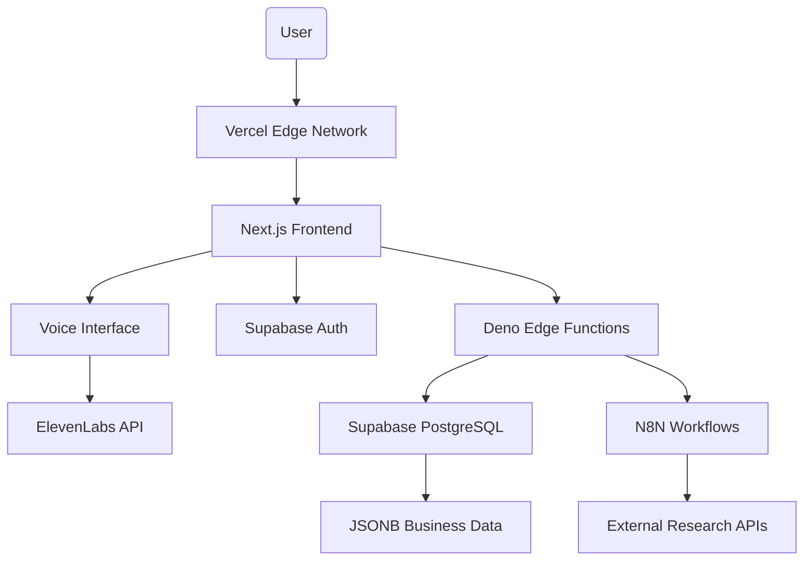

# SuperSwift Interview Agent - Consolidated Architecture Document

## Introduction

This document outlines the consolidated fullstack architecture for the SuperSwift Assessment Interview Agent, reflecting the actual implemented state and removing outdated elements from the original design. This serves as the definitive architectural reference, reconciling the initial vision with the practical implementation using the Next.js SaaS starter kit foundation.

### Project Foundation

The project is built upon the **Next.js SaaS Starter Kit**, which provides a solid foundation of modern web technologies. We've customized it specifically for voice-first business interviews while maintaining the robust architecture and best practices of the original starter kit.

### Change Log

| Date | Version | Description | Author |
|------|---------|-------------|--------|
| 2025-09-17 | 2.0 | Consolidated architecture reflecting actual implementation | Winston 🏗️ |
| 2025-09-17 | 1.0 | Initial architecture draft | Winston 🏗️ |

## High Level Architecture

### Technical Summary

The SuperSwift Interview Agent uses a **monorepo architecture** built on **Next.js with Supabase** as specified in the PRD. The system integrates **ElevenLabs API** for voice-first interactions, **N8N workflows** for data orchestration, and **Supabase** with **Deno Edge Functions** for backend logic. This architecture enables sophisticated business discovery through natural voice interaction while maintaining the complex data structures required for strategic consulting analysis.

### Platform and Infrastructure Choice

**Platform:** Supabase + Vercel  
**Key Services:** Supabase Database, Deno Edge Functions, ElevenLabs API, N8N Workflows  
**Deployment Host and Regions:** Vercel Global Edge Network + Supabase Global  

### Repository Structure

**Structure:** Monorepo architecture (as specified in PRD)  
**Monorepo Tool:** TBD - Will need to implement monorepo structure  
**Package Organization:** Multiple packages for frontend, backend, shared types, and workflows  

### High Level Architecture Diagram



### Architectural Patterns

- **Monorepo Architecture:** Multiple packages for frontend, backend, workflows, and shared types - _Rationale:_ Required by PRD, enables code sharing and coordinated development
- **Voice-First Architecture:** ElevenLabs API integration for natural speech interaction - _Rationale:_ Core requirement for natural business discovery conversations
- **JSONB Data Modeling:** Complex nested business data structures in PostgreSQL - _Rationale:_ Strategic consulting requires sophisticated data capture for business context
- **Workflow Orchestration:** N8N for data flows and external integrations - _Rationale:_ Specified in PRD for backend hosting and data pipeline management
- **Edge Functions Pattern:** Deno Edge Functions for serverless backend logic - _Rationale:_ PRD specification for server-side code execution

## Tech Stack

### Technology Stack Table

| Category | Technology | Version | Purpose | Rationale |
|----------|------------|---------|---------|-----------|
| **Frontend Framework** | Next.js | Latest | Primary frontend framework | PRD requirement, part of nextjs-starter-kit foundation |
| **Backend Runtime** | Deno Edge Functions | Latest | Serverless backend logic | PRD specification for server-side code |
| **Database** | Supabase PostgreSQL | Latest | Primary database with JSONB | PRD requirement, supports complex business data structures |
| **Language** | TypeScript | 5.x | Type-safe development | Essential for monorepo and complex data models |
| **Voice AI** | ElevenLabs API | Latest | Text-to-speech and speech-to-text | PRD requirement for voice-first interface |
| **Authentication** | Supabase Auth | Latest | User authentication and sessions | Integrated with Supabase database |
| **Workflow Engine** | N8N | Latest | Data flows and integrations | PRD requirement for backend hosting and orchestration |
| **UI Components** | shadcn/ui | Latest | Component library | Professional B2B interface requirements |
| **Styling** | Tailwind CSS | Latest | Utility-first CSS framework | Clean, modern, professional design requirement |
| **Monorepo Tool** | TBD | Latest | Multi-package management | PRD requires monorepo structure |
| **Cloud Hosting** | Vercel | Latest | Frontend hosting | Excellent Next.js integration |
| **Testing** | Unit + Integration | Latest | Quality assurance | PRD testing requirements |

## Data Models

### Company Profile (Comprehensive Business Context)

**Purpose:** Store all pre-researched information and refined data from the assessment interview for strategic consulting analysis.

**Key Attributes:**
- company_url: (string) - Company website for research
- strategic_foundation: (jsonb) - Core business model and identity
  - core_identity_business_model: (jsonb)
    - company_mission_vision: (jsonb)
      - data: (jsonb) - Mission, vision, values
      - status: (string) - researched, confirmed, corrected
    - core_offering_definition: (jsonb)
      - data: (jsonb) - Product/service definitions
      - status: (string)
    - regulatory_pathway: (jsonb)
      - data: (jsonb) - Compliance and regulatory framework
      - status: (string)
    - revenue_streams_pricing: (jsonb)
      - data: (jsonb) - Business model and pricing strategy
      - status: (string)
  - customer_market_intelligence: (jsonb)
    - market_sizing: (jsonb)
      - data: (jsonb) - TAM, SAM, SOM analysis
      - status: (string)
    - clinical_evidence: (jsonb)
      - data: (jsonb) - Clinical trials and evidence
      - status: (string)
    - ideal_customer_profile: (jsonb)
      - data: (jsonb) - Target customer definitions
      - status: (string)
    - customer_pains_gains: (jsonb)
      - data: (jsonb) - Customer pain points and value propositions
      - status: (string)
- strategy_positioning: (jsonb) - Market strategy and competitive analysis
  - competitive_landscape: (jsonb)
    - direct_indirect_competitors: (jsonb)
      - data: (jsonb) - Competitor analysis
      - status: (string)
    - competitive_positioning_differentiation: (jsonb)
      - data: (jsonb) - Unique value propositions
      - status: (string)
  - channel_go_to_market: (jsonb)
    - channel_strategy: (jsonb)
      - data: (jsonb) - Distribution channels
      - status: (string)
    - sales_process_methodology: (jsonb)
      - data: (jsonb) - Sales process and methodology
      - status: (string)
    - gtm_team_structure: (jsonb)
      - data: (jsonb) - Go-to-market team organization
      - status: (string)
    - partnership_alliance: (jsonb)
      - strategic_partnership_framework: (jsonb)
      - data: (jsonb) - Strategic partnerships
      - status: (string)
    - partner_enablement: (jsonb)
      - data: (jsonb) - Partner enablement programs
      - status: (string)
  - brand_messaging: (jsonb)
    - brand_positioning_statement: (jsonb)
      - data: (jsonb) - Brand positioning
      - status: (string)
    - core_messaging_pillars: (jsonb)
      - data: (jsonb) - Key messaging framework
      - status: (string)
- execution_operations: (jsonb) - Operational execution and measurement
  - gtm_operations: (jsonb)
    - quality_management_system: (jsonb)
      - data: (jsonb) - QMS and operational processes
      - status: (string)
    - high_level_roadmap: (jsonb)
      - data: (jsonb) - Strategic roadmap
      - status: (string)
    - gtm_process_tech_stack: (jsonb)
      - data: (jsonb) - Technology stack and processes
      - status: (string)
  - performance_measurement_kpis: (jsonb)
    - core_gtm_kpis: (jsonb)
      - data: (jsonb) - Key performance indicators
      - status: (string)
    - strategic_gtm_goals: (jsonb)
      - data: (jsonb) - Strategic goals and targets
      - status: (string)
  - risk_mitigation: (jsonb)
    - comprehensive_gtm_risk: (jsonb)
      - data: (jsonb) - Risk assessment and mitigation
      - status: (string)

### Interview Session

**Purpose:** Track interview progress and conversation history

**Key Attributes:**
- id: string (UUID) - Unique session identifier
- userId: string - References interviewer
- companyProfileId: string - Links to company being interviewed
- conversationLog: string (JSON) - Complete conversation history
- currentStep: string - Current position in interview flow
- status: string - Session state (active, paused, completed)
- createdAt/updatedAt: timestamps - Session timeline

### User (Better Auth)

**Purpose:** User authentication and profile management

**Key Attributes:**
- id: string - Primary key
- name: string - User display name
- email: string - Authentication email
- emailVerified: boolean - Email verification status
- image: string - Profile image URL
- createdAt/updatedAt: timestamps - Account lifecycle

## Database Schema (Supabase PostgreSQL)

```sql
-- Supabase Users Table (managed by Supabase Auth)
-- Users are automatically created by Supabase Auth

-- Company Profiles with Complex JSONB Data Structure
CREATE TABLE public.company_profiles (
    id UUID PRIMARY KEY DEFAULT uuid_generate_v4(),
    user_id UUID REFERENCES auth.users(id),
    company_url TEXT NOT NULL,
    created_at TIMESTAMPTZ DEFAULT now(),
    updated_at TIMESTAMPTZ DEFAULT now(),
    strategic_foundation JSONB DEFAULT '{}'::JSONB,
    strategy_positioning JSONB DEFAULT '{}'::JSONB,
    execution_operations JSONB DEFAULT '{}'::JSONB
);

-- Interview Sessions for Conversation Management
CREATE TABLE public.interview_sessions (
    id UUID PRIMARY KEY DEFAULT uuid_generate_v4(),
    user_id UUID REFERENCES auth.users(id),
    company_profile_id UUID REFERENCES public.company_profiles(id),
    conversation_log JSONB DEFAULT '[]'::JSONB,
    current_step TEXT,
    status TEXT NOT NULL,
    created_at TIMESTAMPTZ DEFAULT now(),
    updated_at TIMESTAMPTZ DEFAULT now()
);

-- Row Level Security (RLS) Policies
ALTER TABLE public.company_profiles ENABLE ROW LEVEL SECURITY;
ALTER TABLE public.interview_sessions ENABLE ROW LEVEL SECURITY;

-- Users can only access their own data
CREATE POLICY "Users can view own company profiles" ON public.company_profiles
    FOR SELECT USING (auth.uid() = user_id);

CREATE POLICY "Users can insert own company profiles" ON public.company_profiles
    FOR INSERT WITH CHECK (auth.uid() = user_id);

CREATE POLICY "Users can update own company profiles" ON public.company_profiles
    FOR UPDATE USING (auth.uid() = user_id);

CREATE POLICY "Users can view own interview sessions" ON public.interview_sessions
    FOR SELECT USING (auth.uid() = user_id);

CREATE POLICY "Users can insert own interview sessions" ON public.interview_sessions
    FOR INSERT WITH CHECK (auth.uid() = user_id);

CREATE POLICY "Users can update own interview sessions" ON public.interview_sessions
    FOR UPDATE USING (auth.uid() = user_id);
```

## Project Structure (Monorepo - Target State)

```
superswift-interview-agent/
├── apps/                       # Application packages
│   ├── web/                   # Next.js Frontend Application
│   │   ├── app/              # Next.js App Router
│   │   │   ├── (auth)/       # Authentication pages
│   │   │   ├── dashboard/    # Protected dashboard area
│   │   │   ├── interview/    # Voice interview interface
│   │   │   └── api/          # Client-side API helpers
│   │   ├── components/       # UI components
│   │   ├── lib/             # Frontend utilities
│   │   └── public/          # Static assets
│   └── functions/            # Deno Edge Functions
│       ├── interview/        # Interview management functions
│       ├── research/         # Company research functions
│       ├── voice/           # ElevenLabs integration
│       └── shared/          # Shared function utilities
├── packages/                 # Shared packages
│   ├── types/               # Shared TypeScript definitions
│   │   ├── interview.ts     # Interview data types
│   │   ├── company.ts       # Company profile types
│   │   └── voice.ts         # Voice interface types
│   ├── supabase/            # Supabase configuration
│   │   ├── client.ts        # Supabase client setup
│   │   ├── database.types.ts # Generated database types
│   │   └── migrations/      # Database migrations
│   ├── ui/                  # Shared UI components
│   └── utils/               # Shared utilities
├── workflows/               # N8N Workflow Definitions
│   ├── company-research/    # Automated research workflows
│   ├── data-enrichment/     # Data processing workflows
│   └── integrations/        # External API integrations
├── docs/                    # Project documentation
│   ├── architecture.md
│   ├── PRD.md
│   └── stories/
├── supabase/                # Supabase project configuration
│   ├── config.toml
│   ├── migrations/
│   └── functions/           # Supabase Edge Functions (if needed)
├── tools/                   # Development and deployment tools
├── package.json             # Root package configuration
├── turbo.json              # Turborepo configuration (or similar)
└── README.md
```

## Current vs Target State

**Current Implementation:** Single Next.js app with local PostgreSQL  
**Target (PRD-Compliant):** Monorepo with Supabase, Deno Edge Functions, and N8N workflows

## Implementation Status

### ✅ Foundation Elements (From Starter Kit)
- **Next.js Framework:** Working foundation with App Router
- **UI Components:** shadcn/ui with Tailwind CSS implemented
- **Basic Authentication:** Better Auth working (needs migration to Supabase Auth)
- **Database Schema:** Basic structure exists (needs JSONB complexity and Supabase migration)

### 🔄 Requires Migration/Refactoring (PRD Compliance)
- **Database Migration:** Local PostgreSQL → Supabase with complex JSONB schema
- **Authentication Migration:** Better Auth → Supabase Auth
- **Monorepo Structure:** Single app → Monorepo with multiple packages
- **Backend Runtime:** Next.js API routes → Deno Edge Functions

### ❌ Missing Critical PRD Requirements
- **ElevenLabs Voice Integration:** Core voice-first interface not implemented
- **N8N Workflow Engine:** Data orchestration and research automation missing
- **Complex JSONB Data Models:** Strategic consulting data structure not implemented
- **Interview Conversation Flow:** Core business discovery logic missing
- **Company Research Pipeline:** Automated business context collection missing

### 📋 PRD Compliance Gap
**Major gaps between current implementation and PRD requirements:**
1. **Voice-First Interface (FR1):** Not implemented - requires ElevenLabs integration
2. **Conversational Flow (FR2):** Missing - needs sophisticated interview logic
3. **Business Context Collection (FR3):** Incomplete - needs complex JSONB data models
4. **Scalable Architecture (NFR1):** Partially met - needs Supabase + Edge Functions
5. **Data Security (NFR2):** Basic - needs Supabase RLS and proper business data handling

## Development Workflow

### PRD-Compliant Local Setup (Target State)
```bash
# Prerequisites (PRD Requirements)
node --version              # Node.js 18+
deno --version             # Deno for Edge Functions
supabase --version         # Supabase CLI (PRD requirement)
npx create-turbo@latest    # Monorepo setup (or similar)

# Supabase Setup (PRD Specification)
supabase init              # Initialize Supabase project
supabase start            # Start local Supabase stack
supabase db reset         # Apply migrations with JSONB schema

# Monorepo Development
npm install               # Install all workspace dependencies
npm run dev              # Start all apps and services
npm run dev:web          # Frontend only
npm run dev:functions    # Deno Edge Functions only
```

### Environment Configuration (PRD Requirements)
```bash
# Supabase Configuration (PRD Specification)
NEXT_PUBLIC_SUPABASE_URL="your-supabase-project-url"
NEXT_PUBLIC_SUPABASE_ANON_KEY="your-supabase-anon-key"
SUPABASE_SERVICE_ROLE_KEY="your-service-role-key"

# ElevenLabs Voice API (PRD Requirement)
ELEVENLABS_API_KEY="your-elevenlabs-api-key"
ELEVENLABS_VOICE_ID="your-selected-voice-id"

# N8N Workflows (PRD Requirement)
N8N_WEBHOOK_URL="your-n8n-instance-url"
N8N_API_KEY="your-n8n-api-key"

# Additional Integrations
OPENAI_API_KEY="your-openai-key"
NEXT_PUBLIC_POSTHOG_KEY="your-posthog-key"
```

## Migration Roadmap (Current → PRD-Compliant)

### Phase 1: Database Migration
1. **Set up Supabase project** with complex JSONB schema
2. **Migrate data models** from simple JSON to structured JSONB
3. **Implement Row Level Security** policies
4. **Replace Drizzle with Supabase client**

### Phase 2: Architecture Refactoring  
1. **Convert to monorepo** structure (Turborepo/Nx)
2. **Migrate to Deno Edge Functions** from Next.js API routes
3. **Implement Supabase Auth** (replace Better Auth)
4. **Set up shared packages** for types and utilities

### Phase 3: Core Feature Implementation
1. **ElevenLabs integration** for voice-first interface (FR1)
2. **Interview conversation engine** with sophisticated flow (FR2)
3. **Business context collection** pipeline (FR3)
4. **N8N workflow automation** for research and data enrichment

### Phase 4: PRD Feature Completion
1. **Complete all Epic 1 stories** (Foundation + Voice Interface)
2. **Implement Epic 2 stories** (Data Collection & Persistence)
3. **Testing strategy** implementation (Unit + Integration)
4. **Production deployment** and scalability validation

## Conclusion

This corrected architecture document now properly reflects the PRD requirements and acknowledges the significant gap between the current starter kit implementation and the sophisticated voice-first business discovery platform specified in the PRD. 

### Key Corrections Made:
- **Restored complex JSONB data models** - Essential for strategic consulting business context
- **Re-emphasized Supabase requirement** - PRD specification for database and auth
- **Highlighted N8N workflow necessity** - Critical for research automation and data orchestration  
- **Clarified monorepo architecture** - Required structure for the sophisticated system
- **Established migration roadmap** - Clear path from current state to PRD compliance

### Critical Understanding:
The **complex JSONB schema** isn't over-engineering - it's the core value proposition for capturing comprehensive business context during strategic consulting interviews. The **N8N workflows** aren't unnecessary complexity - they're essential for automating the research and data enrichment that makes the interviews valuable. **Supabase** isn't optional - it's specified in the PRD for the integrated database, auth, and Edge Functions architecture.

This architecture now serves as an accurate blueprint for building the voice-first strategic consulting interview agent as specified in the PRD.