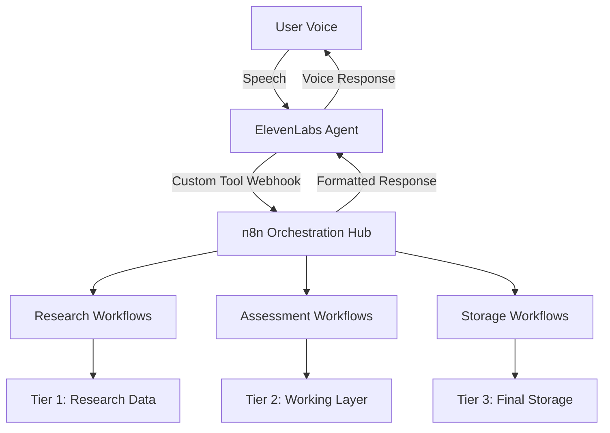

# n8n + ElevenLabs Conversational AI Integration Architecture

## Executive Summary

This document analyzes how n8n can serve as the visual orchestration layer between ElevenLabs Conversational AI and the three-tier data architecture, providing better control and visibility over data flows while maintaining clean separation of concerns.

## Current Understanding: Three-Tier Data Architecture

### Data Layer Clarification

```
┌─────────────────────────────────────────────────────────────┐
│ Tier 1: Research Data (Input Layer)                        │
│ - Raw intelligence from web scraping                       │
│ - Company research and analysis                            │
│ - Temporary storage (90-day retention)                     │
└─────────────────────────────────────────────────────────────┘
                            ↓
┌─────────────────────────────────────────────────────────────┐
│ Tier 2: Assessment Interview Data (Working Layer)          │
│ - Active interview sessions                                │
│ - User responses and validations                          │
│ - Progress tracking and state management                   │
└─────────────────────────────────────────────────────────────┘
                            ↓
┌─────────────────────────────────────────────────────────────┐
│ Tier 3: Business Intelligence (Final Storage Layer)        │
│ - Synthesized insights and recommendations                 │
│ - Permanent company profiles                               │
│ - Strategic analysis and reports                           │
└─────────────────────────────────────────────────────────────┘
```

## Proposed Architecture: n8n as Orchestration Hub

### High-Level Flow



## n8n Workflow Architecture

### 1. Master Orchestration Workflow

**Purpose:** Route ElevenLabs webhook calls to appropriate sub-workflows

```yaml
Trigger: Webhook from ElevenLabs
├── Parse Request Type
├── Route to Appropriate Workflow:
│   ├── Research Context Workflow
│   ├── Assessment Update Workflow
│   ├── Question Generation Workflow
│   └── Final Storage Workflow
└── Return Formatted Response to ElevenLabs
```

### 2. Research Context Workflow (Tier 1 → Tier 2)

**Purpose:** Gather and prepare research data for interview context

```yaml
Workflow: Research Context Collection
├── Trigger: Request for company research
├── Sub-workflows:
│   ├── Web Scraping Flow
│   │   ├── Company website analysis
│   │   ├── LinkedIn data extraction
│   │   ├── News and press releases
│   │   └── Industry reports
│   ├── Data Processing Flow
│   │   ├── Clean and structure data
│   │   ├── Extract key insights
│   │   └── Generate research summary
│   └── Context Preparation Flow
│       ├── Identify knowledge gaps
│       ├── Generate targeted questions
│       └── Store in Tier 1 database
└── Return: Research context for interview
```

### 3. Assessment Update Workflow (Tier 2 Operations)

**Purpose:** Process interview responses and update working data

```yaml
Workflow: Assessment Data Management
├── Trigger: User response from ElevenLabs
├── Processing Steps:
│   ├── Validate Response
│   │   ├── Check completeness
│   │   ├── Verify against research
│   │   └── Flag inconsistencies
│   ├── Update Assessment State
│   │   ├── Mark artifact progress
│   │   ├── Update confidence scores
│   │   └── Track completion status
│   └── Generate Next Action
│       ├── Determine next question
│       ├── Check for transitions
│       └── Prepare follow-ups
└── Return: Next question + context
```

### 4. Final Storage Workflow (Tier 2 → Tier 3)

**Purpose:** Synthesize and store final business intelligence

```yaml
Workflow: Business Intelligence Synthesis
├── Trigger: Assessment completion
├── Synthesis Steps:
│   ├── Data Aggregation
│   │   ├── Compile all responses
│   │   ├── Merge with research data
│   │   └── Resolve conflicts
│   ├── Intelligence Generation
│   │   ├── Generate strategic insights
│   │   ├── Create recommendations
│   │   └── Build company profile
│   └── Storage Operations
│       ├── Store in Tier 3 database
│       ├── Generate reports
│       └── Trigger notifications
└── Return: Completion confirmation
```

## ElevenLabs Agent Configuration with n8n

### Custom Tool Setup

```javascript
{
  "name": "GTM Assessment Interviewer",
  "systemPrompt": "You are conducting a structured GTM assessment. Use the n8n webhook for all data operations.",
  "tools": [
    {
      "type": "webhook",
      "name": "n8n_orchestrator",
      "description": "Main n8n orchestration endpoint",
      "url": "https://your-n8n.com/webhook/interview-orchestrator",
      "parameters": {
        "action": "string", // research|update|question|complete
        "sessionId": "string",
        "data": "object"
      }
    }
  ]
}
```

## Agent Architecture Clarification

### No Internal Agents - Pure Service Architecture

**Important Clarification:** With n8n + ElevenLabs architecture, we don't build "agents" in the app. Instead, we have:

1. **ElevenLabs Conversational AI Agent**
   - Handles all conversation management
   - Maintains context and flow
   - Invokes n8n webhooks via custom tools

2. **n8n Workflows (Visual Logic)**
   - Replace traditional backend "agents"
   - Provide visual, configurable logic flows
   - Handle all data operations

3. **Next.js App (UI Only)**
   - Provides web interface
   - Manages authentication
   - Displays progress and results
   - NO conversation logic

### Data Flow Examples

#### Example 1: Starting an Interview

```
1. User speaks: "Let's begin the assessment"
2. ElevenLabs Agent recognizes intent
3. ElevenLabs calls n8n webhook with action="start"
4. n8n workflow:
   - Fetches research from Tier 1
   - Creates session in Tier 2
   - Generates first question
5. n8n returns question to ElevenLabs
6. ElevenLabs speaks question to user
```

#### Example 2: Processing a Response

```
1. User provides answer about market size
2. ElevenLabs transcribes and sends to n8n
3. n8n workflow:
   - Validates against research data
   - Updates Tier 2 assessment state
   - Checks completion status
   - Generates follow-up question
4. n8n returns next question
5. ElevenLabs continues conversation
```

#### Example 3: Completing Assessment

```
1. Final artifact completed
2. n8n detects completion trigger
3. n8n synthesis workflow:
   - Aggregates all Tier 2 data
   - Generates insights
   - Stores in Tier 3
   - Creates final report
4. n8n returns completion message
5. ElevenLabs thanks user and ends
```

## n8n Workflow Benefits

### Visual Control Advantages

1. **Drag-and-Drop Logic**
   - No code changes for flow modifications
   - Visual debugging of data paths
   - Easy A/B testing of different flows

2. **Built-in Integrations**
   - Database connectors (Supabase)
   - API integrations (OpenAI, web scraping)
   - Communication tools (email, Slack)

3. **Error Handling**
   - Visual error paths
   - Retry logic configuration
   - Fallback workflows

4. **Monitoring**
   - Real-time execution logs
   - Performance metrics
   - Data flow visualization

## Implementation Architecture

### Component Responsibilities

```yaml
ElevenLabs Conversational AI:
  - Voice interaction
  - Conversation management
  - Context maintenance
  - Tool invocation

n8n Orchestration:
  - Business logic
  - Data operations
  - Integration management
  - Workflow coordination

Next.js Application:
  - User interface
  - Authentication
  - Progress display
  - Report viewing

Supabase Database:
  - Tier 1: Research storage
  - Tier 2: Assessment data
  - Tier 3: Business intelligence
```

### n8n Workflow Structure

```
/n8n-workflows/
├── master/
│   └── interview-orchestrator.json
├── research/
│   ├── company-research.json
│   ├── web-scraping.json
│   └── context-preparation.json
├── assessment/
│   ├── response-processing.json
│   ├── state-management.json
│   └── question-generation.json
├── synthesis/
│   ├── data-aggregation.json
│   ├── insight-generation.json
│   └── report-creation.json
└── utilities/
    ├── error-handling.json
    ├── notification.json
    └── logging.json
```

## Security Architecture

### Multi-Layer Security

1. **ElevenLabs → n8n**
   - Webhook authentication
   - IP whitelisting
   - Request signing

2. **n8n → Database**
   - Service account credentials
   - Role-based access
   - Connection pooling

3. **n8n → External APIs**
   - API key management
   - Rate limiting
   - Error masking

## Monitoring and Observability

### n8n Native Monitoring

```yaml
Execution Metrics:
  - Workflow success rate
  - Average execution time
  - Error frequency
  - Data throughput

Business Metrics:
  - Questions per session
  - Completion rate
  - Data quality scores
  - User satisfaction
```

### Custom Dashboards

```javascript
// n8n can push metrics to monitoring services
{
  "workflow": "interview-orchestrator",
  "metrics": {
    "sessions_started": 150,
    "sessions_completed": 120,
    "average_duration": "45 minutes",
    "data_quality_score": 0.92
  }
}
```

## Cost-Benefit Analysis

### Benefits of n8n Integration

1. **Development Speed**
   - 60% faster than coding webhooks
   - Visual debugging reduces troubleshooting time
   - Non-developers can modify flows

2. **Operational Excellence**
   - Built-in error handling
   - Automatic retries
   - Visual monitoring

3. **Flexibility**
   - Easy A/B testing
   - Quick flow modifications
   - No deployment for logic changes

### Considerations

1. **Additional Infrastructure**
   - n8n hosting costs
   - Potential latency (mitigated by optimization)
   - Learning curve for n8n

2. **Complexity**
   - One more system to manage
   - Workflow version control
   - Backup and recovery procedures

## Recommended Implementation Plan

### Phase 1: Foundation (Week 1)
1. Set up n8n instance
2. Create master orchestration workflow
3. Connect ElevenLabs custom tools to n8n
4. Test basic request/response flow

### Phase 2: Research Integration (Week 2)
1. Build research collection workflows
2. Connect to web scraping tools
3. Implement Tier 1 data storage
4. Test context preparation

### Phase 3: Assessment Logic (Week 3)
1. Port assessment logic to n8n workflows
2. Implement state management
3. Build question generation flows
4. Test conversation flow

### Phase 4: Synthesis & Storage (Week 4)
1. Create data synthesis workflows
2. Implement Tier 3 storage
3. Build reporting workflows
4. End-to-end testing

## Architecture Decision Record (ADR)

### Decision: Use n8n as Orchestration Layer

**Status:** Proposed

**Context:** Need visual control over complex data flows between ElevenLabs and three-tier architecture

**Decision:** Implement n8n as the central orchestration hub for all data operations

**Consequences:**
- ✅ Visual workflow management
- ✅ Faster development and iteration
- ✅ Better monitoring and debugging
- ⚠️ Additional infrastructure component
- ⚠️ Potential latency considerations

## Conclusion

The n8n + ElevenLabs architecture provides:

1. **Clear Separation of Concerns**
   - ElevenLabs: Conversation
   - n8n: Business logic
   - Database: Data persistence

2. **Visual Control**
   - See data flows
   - Debug visually
   - Modify without coding

3. **Scalability**
   - Easy to add new workflows
   - Simple integration additions
   - Horizontal scaling possible

This architecture maximizes the strengths of each component while maintaining clean boundaries and excellent observability.