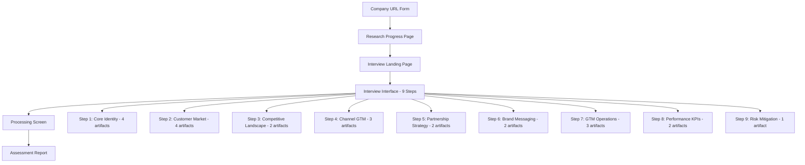

# **SuperSwift UI/UX Specification**

## **Introduction**

This document defines the user experience goals, information architecture, user flows, and visual design specifications for SuperSwift's Assessment Interview Agent user interface. It serves as the foundation for visual design and frontend development of the artifact-based, voice-first interview system with 3-agent collaboration architecture.

### **Change Log**

| Date | Version | Description | Author |
|------|---------|-------------|---------|
| 2025-09-20 | 2.0 | Updated with 9-step assessment, 23-artifact structure, and 3-agent architecture | Winston 🏗️ |
| 2025-09-17 | 1.0 | Initial UX/UI specification | Sally (UX Expert) |

### **Overall UX Goals & Principles**

#### **Target User Personas**

* Our primary user will be a **C-suite executive or board member**. This means our design needs to be exceptionally polished, respectful of their time, and focused on delivering value without friction.

#### **Usability Goals**

* Our core goal is **Effortless Progress**. The experience must be so straightforward and intuitive that the user never feels lost. A **visual progress indicator** will provide clarity and reduce friction.

#### **Design Principles**

* **Clarity over Emojis:** Use professional icons to guide the user, never emojis.  
* **Clarity over cleverness:** Prioritize clear communication over aesthetic innovation.  
* **Progressive disclosure:** Show only what's needed, when it's needed.  
* **Consistent patterns:** Use familiar UI patterns throughout the application.  
* **Immediate feedback:** Every action should have a clear, immediate response.  
* **Accessible by default:** Design for all users from the start.

### **Information Architecture (IA)**

#### **Site Map / Screen Inventory**

The complete assessment workflow includes research, interview, processing, and reporting phases.



#### **Navigation Structure**

* **Primary Navigation:** Progressive workflow with step navigation within interview phase
* **Interview Navigation:** 9-step progress indicator with artifact completion tracking
* **Step Navigation:** Guided progression with skip-ahead warnings for incomplete artifacts
* **Breadcrumb Strategy:** Part > Step > Artifact hierarchy for complex assessment structure

### **User Flows**

#### **Complete Assessment Workflow**

**User Goal:** Complete a comprehensive go-to-market strategy assessment through an AI-guided interview process.

**Entry Points:** Company URL submission form.

**Success Criteria:** User receives a complete template-based assessment report with validated business intelligence.

#### **Primary Flow Diagram**

```mermaid
graph TD  
    A[User submits Company URL] --> B[Research workflow processes data]
    B --> C[Research progress indicator shows completion]
    C --> D[Assessment session auto-created]
    D --> E[User enters interview with smart context loading]
    E --> F[Interview Orchestrator asks dynamic questions per artifact]
    F --> G[Data Validation Agent updates step data]
    G --> H[User navigates between steps - guided progression]
    H --> I[User completes final step - triggers processing UI]
    I --> J[Data Synthesis Agent processes Tier 2 → Tier 3]
    J --> K[User receives template-based assessment report]
```



#### **Interview Step Interaction Flow**

**Voice-First Interaction with Artifact Structure:**

```mermaid
graph TD
    A[User lands on step] --> B[Voice Agent loads - fresh audio state]
    B --> C[Interview Orchestrator loads step research + artifacts]
    C --> D[Dynamic questions based on artifact completion markers]
    D --> E[User voice input → Voice Agent transcription]
    E --> F[Interview Orchestrator analyzes intent & routes]
    F --> G[Data Validation Agent updates artifact data]
    G --> H[Voice Agent synthesizes response]
    H --> I{Artifact complete?}
    I -->|No| D
    I -->|Yes| J[Move to next artifact or step]
```



#### **Artifact-Based UI Interaction**

**Visual Separation and Completion Tracking:**

- **Artifact Separators:** Visual dividers between artifacts within each step
- **Completion Indicators:** Per-artifact status (pending, in-progress, completed)
- **Voice Integration:** Voice controls maintain state across artifact interactions
- **Step Navigation:** Users can skip ahead with warnings for incomplete artifacts

### **Wireframes & Mockups**

#### **Key Screen Layouts**

**1. Company URL Form**
- Clean, professional input form for company URL submission
- Single prominent CTA button to start research process
- Clear messaging about what happens next

**2. Research Progress Page**
- Progress indicator showing n8n workflow status
- Estimated completion time (typically 2-5 minutes)
- Clear messaging about research activities being performed

**3. Interview Landing Page**
- Welcome message with assessment session auto-created
- Overview of 9-step assessment process (3 parts, 23 artifacts)
- Voice interface introduction and browser permissions
- Clear CTA to begin interview

**4. Interview Interface - Artifact-Based Layout**
```
┌─────────────────────────────────────────────────────────────┐
│ PART 1: STRATEGIC FOUNDATION • Step 1/9: Core Identity     │
│ ┌─────────────────┐ ┌─────────────────┐ ┌─────────────────┐ │
│ │ Step 1 │ Step 2 │ │ Step 3 │ Step 4 │ │ Step 5 │ Step 6 │ │
│ │ ●●●●   │ ○○○○   │ │ ○○     │ ○○○    │ │ ○○     │ ○○     │ │
│ └─────────────────┘ └─────────────────┘ └─────────────────┘ │
├─────────────────────────────────────────────────────────────┤
│ ┌─ ARTIFACT 1: Company Mission & Vision ─────────── ✓ ──┐   │
│ │ [Research Data] + [User Confirmations/Corrections]    │   │
│ │ [Voice Controls: 🎤 🔊 Status: Ready]                │   │
│ ├─────────────────────────────────────────────────────────┤   │
│ ┌─ ARTIFACT 2: Core Offering Definition ─────────── ⏳ ─┐   │
│ │ [Research Data] + [Voice Interaction Area]            │   │
│ │ [Voice Controls: 🎤 🔊 Status: In Progress]           │   │
│ ├─────────────────────────────────────────────────────────┤   │
│ ┌─ ARTIFACT 3: Regulatory Pathway ──────────────── ○ ───┐   │
│ │ [Research Data] + [Pending User Input]                │   │
│ │ [Voice Controls: 🎤 🔊 Status: Pending]               │   │
│ └─────────────────────────────────────────────────────────┘   │
└─────────────────────────────────────────────────────────────┘
```

**5. Processing Screen**
- Clear progress indicator with estimated time (30-60 seconds)
- Messaging about data synthesis happening
- No user interaction required during processing

**6. Assessment Report**
- Professional document layout organized by 3 parts
- Each artifact presented with validated data
- Template-based structure with business intelligence
- Clear next steps and account creation CTA

### **Component Library / Design System**

**Design System Approach:** shadcn/ui with SuperSwift Design System overlay (Executive Professional theme)

#### **Core Assessment Components**

**Progress & Navigation:**
- `AssessmentProgress` - 9-step progress indicator with part grouping
- `StepNavigation` - Step switching with completion warnings
- `ArtifactProgress` - Per-artifact completion indicators
- `PartHeader` - Strategic Foundation / Strategy & Positioning / Execution headers

**Artifact Display Components:**
- `ArtifactCard` - Individual artifact container with visual separators
- `ArtifactHeader` - Artifact title with completion status icons
- `ResearchDataDisplay` - Formatted research findings presentation
- `UserValidationArea` - Confirmations, corrections, additions display

**Voice Interface Components:**
- `VoiceAgent` - Pure I/O interface with transcription/synthesis
- `VoiceControls` - Microphone, speaker, status indicators
- `VoiceStatus` - Visual feedback for recording/playing states
- `AudioLevelIndicator` - Voice activity detection feedback

**Interview Flow Components:**
- `InterviewOrchestrator` - Business logic coordinator (hidden UI component)
- `DynamicQuestionDisplay` - Context-aware question presentation
- `StepCompletionTracker` - Open questions and completion markers

**Processing & Report Components:**
- `ProcessingScreen` - Data synthesis progress UI
- `AssessmentReport` - Template-based final report layout
- `BusinessIntelligenceCard` - Validated artifact presentation

#### **Enhanced shadcn Integration**
- Leverage shadcn MCP for component discovery and patterns
- Follow SuperSwift Design System color palette and typography
- Maintain accessibility standards across all voice interactions
- Use professional icons (no emojis) for all status indicators

### **Branding & Style Guide**

#### **Visual Identity**

* **Brand Guidelines:** The visual style will be a minimal impact overlay on the base shadcn/ui styleguide, characterized by **minimal chrome and clean interfaces**.  
* **Brand Voice Tone:** The tone will be **short, crisp, bold, and board-level reassuring**, projecting **near-AGI competence**.  
* **Brand Voice Style:** Communications will be **concise and direct**, authoritative, forward-looking, and emphasize speed and efficiency in all interactions.

#### **Color Palette**

| Color Type | Hex Code | Usage |
| :---- | :---- | :---- |
| Primary | \#FF5D3B | Main actions, highlights, and primary UI elements. |
| Secondary | \#0A0A0A | Text, backgrounds, and other foundational elements. |
| Accent | Gradient | Interactive elements, special effects, and visual flair. |

#### **Typography**

* **Font Families:** A modern, clean **sans-serif** font family will be used for all text to maintain a professional and crisp appearance.  
* **Type Scale:** (To be defined in the front-end-architecture document)

### **Checklist Results**

*(To be run by the PO agent after document completion)*

### **Next Steps**

*(To be completed after final sign-off)*